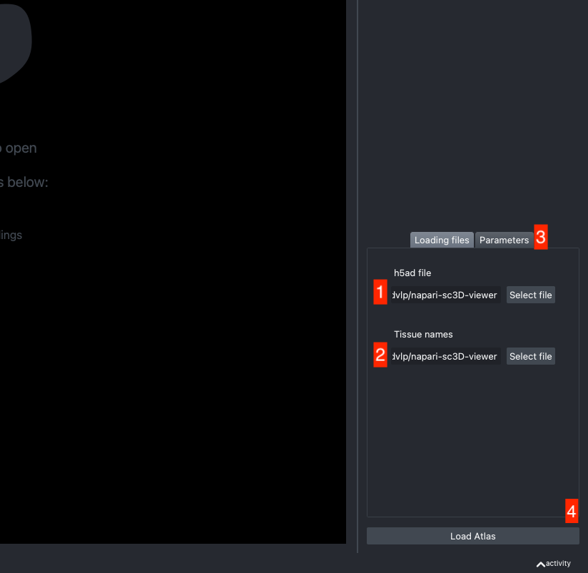
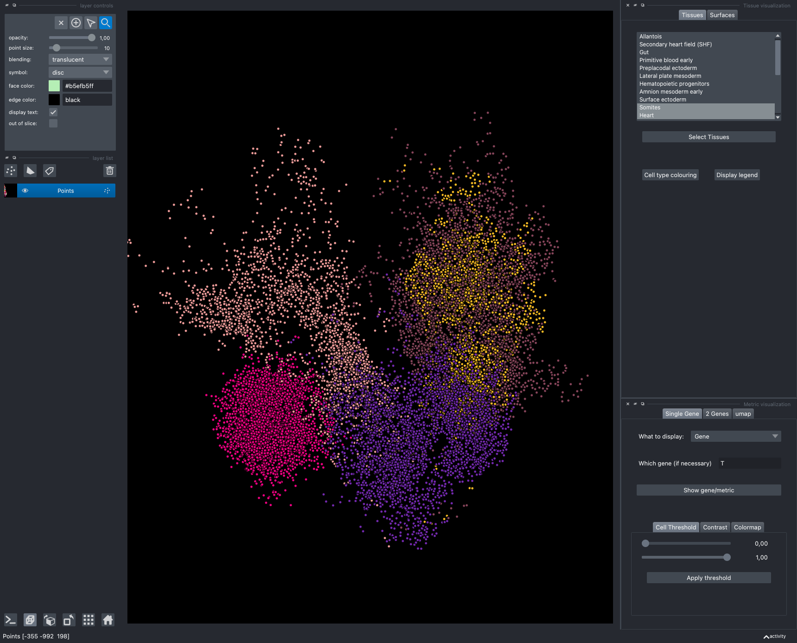
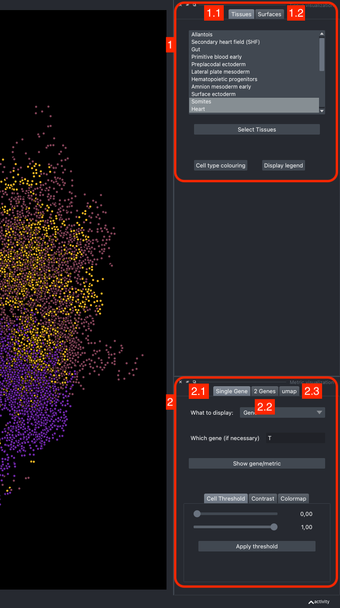

# napari-sc3D-viewer

<!-- [](https://raw.githubusercontent.com/GuignardLab/napari-sc3D-viewer/main/LICENSE) -->
<!-- [](https://python.org) -->
[](https://pypi.org/project/napari-sc3D-viewer)
[](https://github.com/GuignardLab/napari-sc3D-viewer/actions)
[](https://codecov.io/gh/GuignardLab/napari-sc3D-viewer)
[](https://napari-hub.org/plugins/napari-sc3D-viewer)


A plugin to visualise 3D spatial single cell omics

----------------------------------

This [napari] plugin was generated with [Cookiecutter] using [@napari]'s [cookiecutter-napari-plugin] template.

## Installation

You can install `napari-sc3D-viewer` via [pip]:

    pip install .
(from the correct folder)
or

    pip install napari-sc3D-viewer

To install latest development version :

    pip install git+https://github.com/GuignardLab/napari-sc3D-viewer.git

To install the surface computation enabled version it is necessary to use Python 3.9 (until [VTK] is ported to Python 3.10) and you can run one of the following commands:

    pip install '.[pyvista]'
from the correct folder or

    pip install 'napari-sc3D-viewer[pyvista]'

to install directly from pip or

    pip install 'napari-sc3D-viewer[pyvista] @ git+https://github.com/GuignardLab/napari-sc3D-viewer.git'

to install the latest version

## Usage

`napari-sc3D-viewer` allows users to easily visualise and navigate 3D spatial single-cell transcriptomics using napari.

### Loading and opening a dataset

<!-- To test your the plugin you can download the following dataset composed of a id to tissue name file located [there](https://github.com/GuignardLab/sc3D/tree/main/data) and a scanpy h5ad dataset [there](https://figshare.com/s/1c29d867bc8b90d754d2). The dataset is from the following publication: [pub] -->

The expected dataset is a [scanpy]/[anndata] h5ad file together with an optional json file that maps cluster id numbers to actual tissue/cluster name.

The json file should look like that:
```json
{
    "1": "Endoderm",
    "2": "Heart",
    "10": "Anterior neuroectoderm"
}
```
If no json file or a wrong json file is given, the original cluster id numbers are used.

The h5ad file should be informed in (1) and the json file in (2).


Let `data` be your h5ad data structure. To work properly, the viewer is expecting 4 different columns to be present in the h5ad file:
- the cluster id column (by default named 'predicted.id' that can be accessed as `data.obs['predicted.id']`)
- the 3D position column (by default named 'X_spatial_registered' that can be accessed as `data.obsm['X_spatial_registered']`)
- the gene names if not already in the column name (by default named 'feature_name' that can be accessed as `data.var['feature_name']`)
- umap coordinates (by default named 'X_umap' that can be accessed as `data.obsm['X_umap']`)

If the default column names are not consistent with your dataset, they can be changed in the tab `Parameters` (3) next to the tab `Loading files`

Once all the data paths and fields are correctly informed pressing the `Load Atlas` button (4) will load the dataset.

### Exploring a dataset

Once the dataset is loaded there are few options to explore it.

The viewer should look like to the following:


It is divided in two main parts, the Tissue visualisation (1) part and the Metric visualisation (2) one.
Both of them are themselves split in two and three tabs respectively. All these tabs allow you to visualise and explore the dataset in different fashions.

The Tissues tab (1.1) allows to select the tissues to display, to show the legend and to colour the cells according to their tissue types.

The Surfaces tab (1.2) allows to construct coarse surfaces of tissues and to display them.

The Single metric tab (2.1) allows to display a metric, whether it is a gene intensity or a numerical metric that is embedded in the visualised dataset. This tab also allows to threshold cells according to the viewed metric, to change the contrast and the colour map.

The 2 Genes (2.2) tab allows to display gene coexpression.

The umap tab (2.3) allows to display the umap of the selected cells and to manually select subcategories of cells to be displayed.



#### Explanatory "videos".
The plugin is meant to be easy to use. That means that you should be able to play with it and figure things out by yourself.

That being said, it is not always that easy. You can find below a series of videos showing how to perform some of the main features.

#### Loading data


#### Selecting tissues


#### Displaying one gene


#### Displaying two genes co-expression


#### Playing with the umap


#### Computing and processing the surface


## Contributing

Contributions are very welcome. Tests can be run with [tox], please ensure
the coverage at least stays the same before you submit a pull request.

## License

Distributed under the terms of the [MIT] license,
"napari-sc3D-viewer" is free and open source software

## Issues

If you encounter any problems, please [file an issue] along with a detailed description.

[napari]: https://github.com/napari/napari
[Cookiecutter]: https://github.com/audreyr/cookiecutter
[@napari]: https://github.com/napari
[MIT]: http://opensource.org/licenses/MIT
[BSD-3]: http://opensource.org/licenses/BSD-3-Clause
[GNU GPL v3.0]: http://www.gnu.org/licenses/gpl-3.0.txt
[GNU LGPL v3.0]: http://www.gnu.org/licenses/lgpl-3.0.txt
[Apache Software License 2.0]: http://www.apache.org/licenses/LICENSE-2.0
[Mozilla Public License 2.0]: https://www.mozilla.org/media/MPL/2.0/index.txt
[cookiecutter-napari-plugin]: https://github.com/napari/cookiecutter-napari-plugin

[file an issue]: https://github.com/GuignardLab/napari-sc3D-viewer/issues

[napari]: https://github.com/napari/napari
[tox]: https://tox.readthedocs.io/en/latest/
[pip]: https://pypi.org/project/pip/
[PyPI]: https://pypi.org/
[VTK]: https://vtk.org/
[scanpy]: https://scanpy.readthedocs.io/en/latest/index.html
[anndata]: https://anndata.readthedocs.io/en/latest/